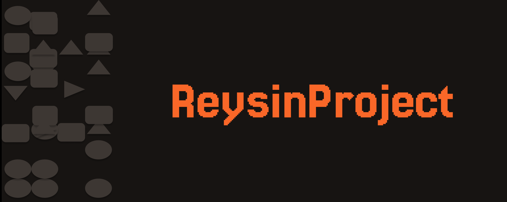

<p align="center">
  <br/>
  <a href="http://reysin.fr/">Reysin</a> is a React Framework for a more structural web
  <br/>
  When structure and rigidity meet facility and efficiency
  <br/><br/>
</p>

````
````

<p align="center">⚠️ Please note that the package is in the experimental development phase. You may use it at your own risk.  ⚠️</p>

````
````


## Table of contents

- [🚀 Getting Started](#-getting-started)
- [🧩 What it does ?](#-what-it-does-)
    - [📱 Declarative UI Binding](#-declarative-ui-binding)
    - [🔄 Two-Way Data Flow](#-two-way-data-flow)
    - [🏗 Clear Architecture Separation](#-clear-architecture-separation)
    - [🎯 For Developers](#-for-developers)
        - [📈 Increased Productivity](#-increased-productivity)
        - [🧪 Better Testing](#-better-testing)
        - [⚖️ Enhanced Maintainability](#️-enhanced-maintainability)
- [📖 Documentation](#-documentation)
- [🛣️ Roadmap](#️-roadmap)
- [❤️ Contribute](#️-contribute)
- [🏠 Local Development](#-local-development)

## 🚀 Getting Started

The **recommanded** way to create a new project with reysin is by running the following command :

```bash
pnpm create @reysin/project@latest
```

## 🧩 What it does ?

### 📱 Declarative UI Binding

- Automatic UI updates through reactive data binding
- Seamless synchronization between View and ViewModel
- Reduced boilerplate code for state management
- Built-in error boundary handling for UI components

### 🔄 Two-Way Data Flow

- Bidirectional data binding between View and ViewModel
- Automatic state updates without manual event handling
- Form handling with built-in validation support
- Real-time UI updates with optimized performance

### 🏗 Clear Architecture Separation

- Distinct separation between business logic and UI components
- Modular component structure for better code organization
- Improved code reusability across components
- Clear responsibilities for each architectural layer

### 🎯 For Developers

#### 📈 Increased Productivity

- Reduced development time through clear architectural patterns
- Built-in state management solutions
- Reusable ViewModels across different views
- Comprehensive debugging tools and dev extensions

#### 🧪 Better Testing

- Isolated business logic for easier unit testing
- Mockable ViewModels for component testing
- Reduced test complexity through separation of concerns
- Built-in testing utilities and helpers

#### ⚖️ Enhanced Maintainability

- Clear code organization and structure
- Reduced coupling between components
- Easier refactoring and updates
- Self-documenting architecture

## 📖 Documentation

Visit the documentation website: [Official Documentation](https://reysinproject.github.io/documentation/).

## 🛣️ Roadmap

It's the start of the project the roadmap is more like an list of possible implementation we like to have

- Configure Vite for Server-Side Rendering (SSR)
- Set up SEO and meta tags
- Implement Model, ViewModel, and View components
- Establish data flow and binding between layers
- Integrate a state management solution
- Manage global and local state in the MVVM structure
- Implement client-side and server-side routing
- Handle dynamic routes and SEO considerations
- Design API layer for fetching data
- Implement caching and optimization strategies
- Create a plugin architecture for extending framework functionality
- Allow customization and integration of third-party plugins
- Integrate Tailwind CSS or a similar utility-first CSS framework
- Provide theming capabilities and style customization
- Set up unit and integration tests for Models, ViewModels, and Views
- Ensure comprehensive test coverage, including SSR and routing
- Generate comprehensive documentation for the framework
- Provide examples, guides, and tooling for seamless developer onboarding
- Automate build, testing, and deployment processes
- Ensure cross-browser and cross-device compatibility

## ❤️ Contribute
**New contributors welcome!** Check out our [Contributors Guide](CONTRIBUTING.md) for help getting started.

We invite you to contribute and help improve Reysin ❤️

Here are a few ways you can get involved:

- **Reporting Bugs**: If you come across any bugs or issues, please check out the [reporting bugs guide]() to learn how to submit a bug report.
- **Suggestions**: Have ideas to enhance Reysin? We'd love to hear them! Let's talk about it in the [discussion section](https://github.com/orgs/ReysinProject/discussions).
- **Questions**: If you have questions or need assistance, the getting help guide provides resources to help you out on the [Discord](https://discord.gg/BT29p5hnwG).


Join us on [Discord](https://discord.gg/BT29p5hnwG) to meet other maintainers. We'll help you get your first contribution in no time!

## 🏠 Local Development

Follow the docs to [Set Up Your Local Development Environment](LOCAL_DEVELOPMENT.md) to contribute to the framework and documentation.